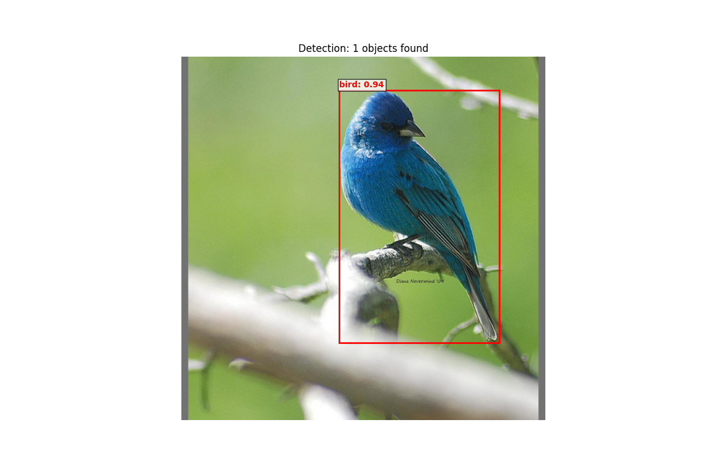

# YOLO-Keras

This repository contains Keras implementations of YOLO models with weight conversion utilities from PyTorch.

## Installation

1. Clone the repository:
```bash
git clone https://github.com/IMvision12/yolo-keras.git
cd yolo-keras
```

2. Create and activate a virtual environment:
```bash
# On Windows
python -m venv env
.\env\Scripts\activate

# On Linux/Mac
python -m venv env
source env/bin/activate
```

3. Install the required packages:
```bash
pip install -r requirements.txt
```

## Basic Usage

```python
from convert_weight import transfer_torch_to_keras_weights
from yolov8_model import YoloV8m
from ultralytics import YOLO
from yolo_post_processor import YoloPostProcessor
from yolo_pre_processor import YoloPreProcessor
from utils import visualize_yolo_detections

import keras


keras_model = YoloV8m(input_shape=(None, None, 3), nc=80)
torch_model = YOLO("yolov8m.pt")
transfer_torch_to_keras_weights(torch_model, keras_model, show_progress=True)
keras_model.load_weights("yolov8m.weights.h5")

pre_processor = YoloPreProcessor()
image = keras.utils.load_img("bird.png")
image_array = keras.utils.img_to_array(image)
result = pre_processor(image_array)

keras_raw_output = keras_model(result)

post_processor = YoloPostProcessor()
output = post_processor(keras_raw_output)

visualize_yolo_detections(result["images"].numpy().squeeze()[:, :, ::-1], output)
```


## License

- The code in this repository is licensed under the Apache License 2.0. See [LICENSE](LICENSE) for details.
- The official YOLO weights are licensed under the [AGPL-3.0 license](https://github.com/ultralytics/ultralytics/blob/main/LICENSE). Converting and using these weights makes your project subject to AGPL-3.0 license requirements.
