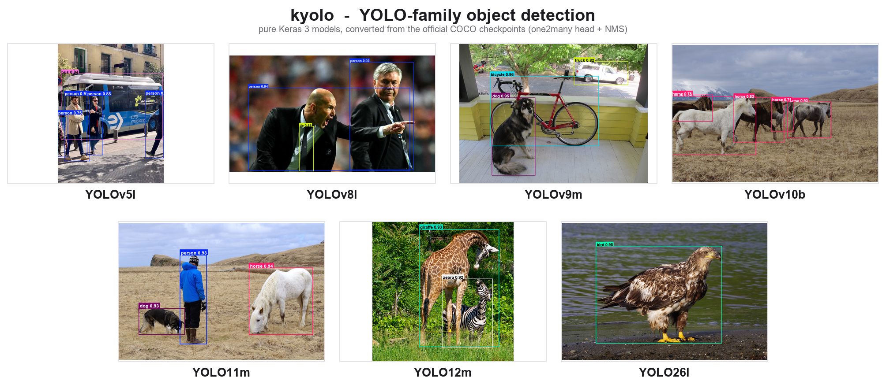

# kyolo - YOLO in pure Keras 3


`kyolo` is a pure [Keras 3](https://keras.io) reimplementation of the YOLO
object-detection family (YOLOv5, v8, v9, v10, YOLO11, YOLO12, YOLO26). Every
layer, loss, and pre/post-processing step is written entirely in `keras.ops`, so
the **exact same code runs unchanged on the TensorFlow, JAX, and PyTorch
backends**. It ships with utilities that convert the official PyTorch checkpoints
into Keras `.weights.h5` files, faithfully enough to reproduce the reference
outputs.



<p align="center"><em>Seven kyolo models, each loaded from its official COCO
checkpoint (converted to Keras with the per-model converter) and run on a
different image. Decoded with the one2many head + NMS. See
<a href="#weight-conversion">Weight conversion</a>.</em></p>

## Highlights

- **One codebase, three backends.** Pure `keras.ops` throughout: models, losses,
  DFL decode, NMS and letterbox all run on TensorFlow, JAX or PyTorch, CPU or GPU.
- **7 families, 36 variants.** YOLOv5 / v8 / v9 / v10 / YOLO11 / YOLO12 / YOLO26,
  each a one-line factory function.
- **Faithful weight conversion.** Every official COCO checkpoint transfers with
  **0 unmatched weights** and reproduces the reference PyTorch head outputs to a
  few times `1e-4` (fp32 rounding).
- **channels_last and channels_first.** Switch the whole library with a single
  `keras.config.set_image_data_format(...)` call.
- **Standard `keras.Model`.** Trainable with `.fit()`, fine-tunable, and
  serializable with no special machinery.

## Supported models

| Family  | Variants                | Backbone                        | Detection head                              |
| ------- | ----------------------- | ------------------------------- | ------------------------------------------- |
| YOLOv5  | `n` `s` `m` `l` `x`     | CSP (C3) + SPPF                 | Anchor-free, DFL, NMS                       |
| YOLOv8  | `n` `s` `m` `l` `x`     | CSP (C2f) + SPPF               | Anchor-free, DFL, NMS                       |
| YOLOv9  | `t` `s` `m` `c` `e`     | RepNCSPELAN + SPPELAN          | Anchor-free, DFL, NMS                       |
| YOLOv10 | `n` `s` `m` `b` `l` `x` | C2f / C2fCIB + SCDown + PSA    | Anchor-free, DFL, **end-to-end (NMS-free)** |
| YOLO11  | `n` `s` `m` `l` `x`     | C3k2 + C2PSA + SPPF            | Anchor-free, DFL, NMS                       |
| YOLO12  | `n` `s` `m` `l` `x`     | C3k2 + A2C2f (area attention)  | Anchor-free, DFL, NMS                       |
| YOLO26  | `n` `s` `m` `l` `x`     | C3k2 + C2PSA + SPPF            | Anchor-free, **DFL-free** (`reg_max=1`), **end-to-end (NMS-free)** |

Each variant is a **factory function** named `<family><variant>`, imported
directly from `kyolo.models` (or `kyolo`):

```python
from kyolo.models import yolov5n, yolov8m, yolo11s, yolov9c, yolov10n

model = yolov8m(nc=80)  # -> keras.Model
```

`kyolo.models.MODEL_NAMES` lists all 36 factories. Regardless of family, a
model's forward pass returns a **list of 3 raw feature maps** `[P3, P4, P5]`,
each of shape `(B, Hi, Wi, 4 * reg_max + nc)` in channels-last layout (with
strides `(8, 16, 32)`). Boxes are decoded from these by `YOLOPostprocessor`.

> **On the end-to-end families (v10, v26).** kyolo builds the standard
> **one2many** detection head, which is decoded with NMS. The official models
> add a parallel *one2one* head for NMS-free inference; kyolo does not reproduce
> that head, so decode v10 / v26 with a normal NMS `YOLOPostprocessor` (as in the
> image above).

## Conversion fidelity

Each model in the image above was built and loaded from an official COCO
checkpoint that was converted with its per-model converter (see
[Weight conversion](#weight-conversion)). The table reports, for each, the
fraction of weights transferred and the **maximum absolute difference** between
kyolo's raw head outputs and the official ultralytics head outputs on an
identical input.

| Model     | Image        | Objects | Weights transferred | Max abs diff vs official |
| --------- | ------------ | :-----: | :-----------------: | :----------------------: |
| YOLOv5l   | `bus.jpg`    |    5    |    100% (0 misses)  |        `9.7e-05`         |
| YOLOv8l   | `zidane.jpg` |    3    |    100% (0 misses)  |        `7.5e-05`         |
| YOLOv9m   | `dog.jpg`    |    3    |    100% (0 misses)  |        `6.1e-04`         |
| YOLOv10b  | `horses.jpg` |    5    |    100% (0 misses)  |        `9.4e-05`         |
| YOLO11m   | `person.jpg` |    3    |    100% (0 misses)  |        `1.2e-04`         |
| YOLO12m   | `giraffe.jpg`|    2    |    100% (0 misses)  |        `5.1e-05`         |
| YOLO26l   | `eagle.jpg`  |    1    |    100% (0 misses)  |        `6.9e-04`         |

These are fp32 rounding differences, not architectural approximations: all
variants of every family transfer with 0 misses and match to the same order of
magnitude.

## Installation

`kyolo` needs Keras 3 plus **exactly one** backend. Install the package in
editable mode with the backend extra you want:

```bash
# pick ONE backend
pip install -e ".[tensorflow]"
pip install -e ".[jax]"
pip install -e ".[torch]"

# optional extras
pip install -e ".[conversion]"  # torch + ultralytics, for weight conversion
```

Visualization (`matplotlib` + `pillow`, used by the examples) ships with the
base install. Select the active backend with the `KERAS_BACKEND` environment
variable **before importing anything**:

```bash
export KERAS_BACKEND=jax          # or "tensorflow" / "torch"
```

```python
import os

os.environ["KERAS_BACKEND"] = "jax"  # must be set before `import keras`
```

## Quickstart: inference

```python
import keras

from kyolo.models import yolov8n  # every variant is a factory: yolov5l, yolo11m, ...
from kyolo.preprocessing import YOLOPreprocessor
from kyolo.postprocessing import YOLOPostprocessor
from kyolo.utils import visualize_detections, COCO_CLASS_NAMES

# 1. Build a model and load converted weights. kyolo does not download or convert
#    the official (AGPL-3.0) weights for you; convert a .pt yourself first (see
#    "Weight conversion" below), then load the resulting .weights.h5 file.
model = yolov8n(weights="yolov8n.weights.h5")
# model = yolov8n(deploy=True)                          # or random init (architecture only)

# 2. Preprocess: letterbox to a square and normalize to [0, 1].
preprocessor = YOLOPreprocessor(image_size=640, normalize=True, letterbox=True)
batch = preprocessor.from_files("assets/samples/bus.jpg")
# batch == {"images": (B, 640, 640, 3), "ratio": (B, 2), "pad": (B, 2)}

# 3. Forward pass -> list of 3 raw feature maps [P3, P4, P5].
raw_feats = model(batch["images"])

# 4. Postprocess -> (B, max_detections, 6) = [x1, y1, x2, y2, score, class_id].
#    Read reg_max / end_to_end off the model so the same code works for every family.
postprocessor = YOLOPostprocessor(
    nc=80,
    reg_max=model.reg_max,
    strides=model.strides,
    conf_threshold=0.25,
    iou_threshold=0.45,
    max_detections=300,
)
detections = postprocessor(raw_feats)

# 5. Visualize the first image in the batch.
image = keras.ops.convert_to_numpy(batch["images"])[0]
dets = keras.ops.convert_to_numpy(detections)[0]
visualize_detections(image, dets, class_names=COCO_CLASS_NAMES, save_path="result.png")
```

A runnable version lives in [`examples/inference.py`](examples/inference.py):

```bash
python examples/inference.py --model yolov8l --weights yolov8l.weights.h5 \
    --image assets/samples/zidane.jpg
```

## Training / fine-tuning

`kyolo.training.YOLODetector` is a `keras.Model` subclass that plugs into
`.fit()`. Datasets yield `(images, targets)` tuples where `targets` is
`{"boxes", "labels", "mask"}` (boxes are xyxy pixels, labels are ints, `mask`
marks real vs. padded boxes). `detector.detect(...)` runs the full decode + NMS
pipeline in one call:

```python
import re
import keras

from kyolo.models import yolov8n
from kyolo.training import YOLODetector

nc = 80
model = yolov8n(nc=nc)
# To fine-tune from COCO, convert an official checkpoint yourself first (see
# "Weight conversion"), then: model = yolov8n(nc=80, weights="yolov8n.weights.h5")

# Optional: freeze the backbone (stages model.0 - model.9) and train only the
# neck + head. Layer names mirror the module index, e.g. "model-6-cv1-conv".
for layer in model.layers:
    m = re.match(r"model-(\d+)", layer.name)
    if m and int(m.group(1)) <= 9:
        layer.trainable = False

# The detector infers nc / reg_max / strides / end_to_end from the model and
# builds the matching criterion from `model.loss_config`, so the gains and the
# assignment settings do not have to be repeated here. Pass `loss=...` to
# override it.
detector = YOLODetector(model)
detector.compile(optimizer=keras.optimizers.Adam(1e-3))

# `dataset` yields (images, {"boxes", "labels", "mask"}) tuples.
detector.fit(dataset, epochs=1, steps_per_epoch=2)

# Convenience: run the full model + decode + NMS pipeline in one call.
detections = detector.detect(images, conf_threshold=0.25, iou_threshold=0.45)
```

A runnable synthetic-data version lives in [`examples/train.py`](examples/train.py).

### The criterion

`kyolo.losses.YOLODetectionLoss` is Ultralytics' `v8DetectionLoss`: task-aligned
label assignment, BCE on soft alignment-scaled class targets, CIoU on the
assigned boxes, and a third regression term whose form follows the box
parameterization — Distribution Focal Loss where the head predicts bins
(`reg_max > 1`), and an image-size-normalized L1 where it predicts distances
directly (`reg_max == 1`, i.e. YOLO26). It is logged as `dfl_loss` or `l1_loss`
accordingly. The assigner also carries Ultralytics' stride-aware small-target
expansion (STAL) and the optional tighter `topk2` pass that one-to-one
assignment needs.

This is checked, not assumed: `tests/integration/test_loss_parity.py` diffs
every term and the assignment itself (`fg_mask`, `target_bboxes`,
`target_scores`) against the installed `ultralytics` package on the torch
backend, and agrees to float32 rounding. Install `ultralytics` and run it with
`KERAS_BACKEND=torch` — it skips otherwise.

## Weight conversion

The official YOLO checkpoints are **AGPL-3.0 licensed** and are **not**
redistributed with this project. kyolo **does not download, cache, or auto-load
them** for you. You obtain a `.pt` yourself and convert it **manually** with the
per-model converter. The converted weights inherit AGPL-3.0.

Conversion needs the `conversion` extra (`pip install -e ".[conversion]"`, which
pulls in `torch` and `ultralytics`). Run the converter for the model you want:

```bash
python -m kyolo.models.yolov8.convert_yolov8_torch_to_keras \
    --weights yolov8n.pt --output yolov8n.weights.h5 --variant n
```

Every family ships the same converter at
`kyolo/models/<family>/convert_<family>_torch_to_keras.py`, for example:

```bash
python -m kyolo.models.yolo11.convert_yolo11_torch_to_keras \
    --weights yolo11m.pt --output yolo11m.weights.h5 --variant m

python -m kyolo.models.yolo26.convert_yolo26_torch_to_keras \
    --weights yolo26l.pt --output yolo26l.weights.h5 --variant l
```

Then load the result into the matching factory (Keras weights only):

```python
from kyolo.models import yolov8n

model = yolov8n(nc=80, weights="yolov8n.weights.h5")  # .weights.h5 / .keras only
```

For scripting, the programmatic entry point is
`from kyolo.conversion import convert_weights`.

> Conversion is **best-effort**: layer-name and tensor-layout mappings are
> maintained by hand, so always validate a converted model's outputs against the
> reference PyTorch implementation before trusting it (the
> [fidelity table](#conversion-fidelity) above is exactly this check).

## Data format (channels_last / channels_first)

Every model, loss and pre/post-processor takes a `data_format` argument. Leaving
it as the default (`None`) follows the global Keras setting
`keras.config.image_data_format()`, so one call switches the whole library:

```python
import keras
from kyolo.models import yolov8n

keras.config.set_image_data_format("channels_first")
model = yolov8n(nc=80, input_shape=(3, 640, 640))  # (C, H, W) inputs, (B, C, H, W) feats

# ...or override per call, ignoring the global setting:
model = yolov8n(nc=80, input_shape=(640, 640, 3), data_format="channels_last")
```

`input_shape` is `(H, W, C)` for channels_last and `(C, H, W)` for
channels_first. `YOLOPreprocessor` always accepts channels_last `(H, W, C)`
images and returns them in the requested layout.

## License

- The **code** in this repository is licensed under the
  [Apache License 2.0](LICENSE).
- The official YOLO **weights** are licensed under
  [AGPL-3.0](https://github.com/ultralytics/ultralytics/blob/main/LICENSE).
  They are not shipped here; anything you convert from them inherits AGPL-3.0,
  and using such weights subjects your project to the AGPL-3.0 requirements.
